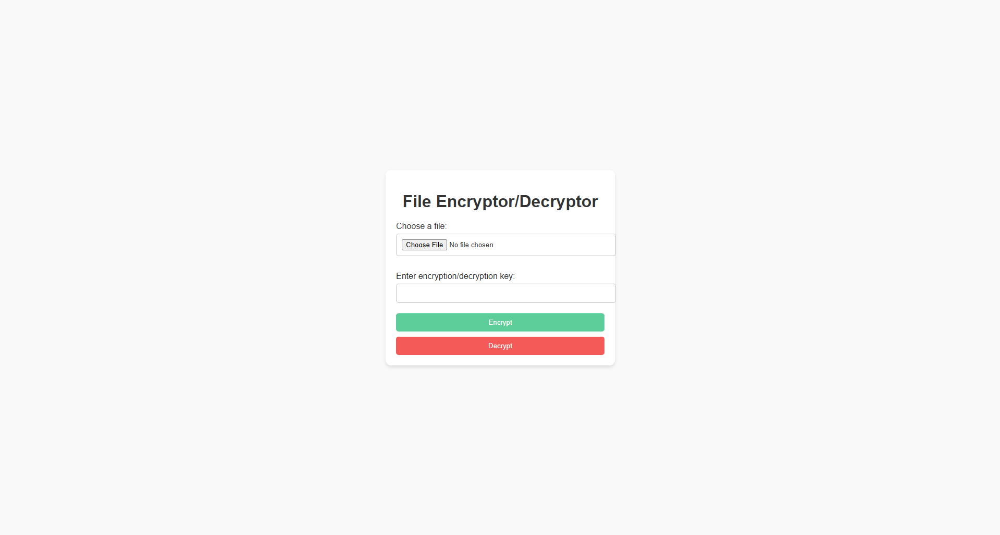
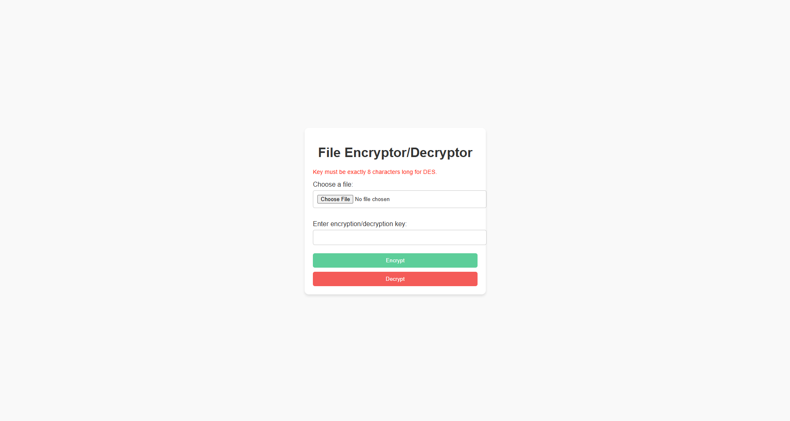

# Enkripsi/Dekripsi File

## Pengantar
Proyek mini ini adalah aplikasi web sederhana yang dibangun menggunakan Flask, yang memungkinkan pengguna untuk mengenkripsi dan mendekripsi file menggunakan algoritma DES. Aplikasi ini memberikan antarmuka yang ramah pengguna sambil memastikan proses enkripsi dan dekripsi berjalan dengan aman.

## Fitur
- **Unggah File**: Pengguna dapat mengunggah file untuk dienkripsi atau didekripsi.
- **Enkripsi DES**: Menggunakan algoritma DES dengan mode CBC untuk keamanan data.
- **Masukkan Kunci Kustom**: Pengguna dapat memberikan kunci mereka sendiri untuk proses enkripsi/dekripsi.
- **Penanganan Kesalahan**: Menampilkan pesan yang jelas jika terjadi kesalahan selama proses dekripsi karena kunci yang salah atau file yang dimanipulasi.
- **Antarmuka Responsif**: Tombol dengan warna pastel untuk pengalaman pengguna yang lebih baik.

## Memahami DES-CBC
### Apa itu DES?
DES (**Data Encryption Standard**) adalah algoritma enkripsi simetris yang digunakan secara luas di masa lalu untuk mengamankan data. Algoritma ini bekerja pada blok data berukuran tetap (64 bit) dan menggunakan kunci dengan ukuran 8 byte (56 bit efektif). Meskipun DES saat ini dianggap kurang aman untuk aplikasi modern, algoritma ini tetap menjadi alat pembelajaran yang berguna.

### Apa itu CBC (Cipher Block Chaining)?
CBC (**Cipher Block Chaining**) adalah mode operasi untuk algoritma blok seperti DES yang memastikan:
1. **Kerahasiaan**: Setiap blok plaintext di-XOR dengan blok ciphertext sebelumnya sebelum dienkripsi, sehingga pola dalam plaintext tidak terlihat.
2. **Chaining**: Proses enkripsi setiap blok bergantung pada ciphertext blok sebelumnya, membuatnya lebih aman dibandingkan mode ECB (Electronic Codebook).

### Melindungi dari Kunci yang Tidak Valid
DES-CBC tidak memiliki fitur otentikasi bawaan seperti AES-GCM, sehingga kami menambahkan langkah perlindungan tambahan:
- Selama enkripsi, **magic header** ditambahkan ke plaintext untuk validasi selama dekripsi.
- Jika kunci salah atau file telah dimanipulasi, aplikasi akan menampilkan pesan berikut:
```
Gagal mendekripsi: Kunci tidak valid atau file telah dimanipulasi.
```

Langkah ini memastikan data tetap aman dan tidak dapat dibaca dalam kondisi yang salah atau jahat.

## Teknologi yang Digunakan
- **Backend**: Python, Flask
- **Frontend**: HTML, CSS
- **Pustaka Enkripsi**: PyCryptodome

## Persyaratan
- Python 3.8 atau lebih baru
- Dukungan virtual environment (`venv`)

## Instalasi dan Pengaturan
1. Klon repositori ini:
   ```bash
   git clone <repository-url>
   cd <repository-directory>
   ```

2. Buat dan aktifkan virtual environment:
   ```bash
   python -m venv .venv
   .\.venv\Scripts\activate
   ```

3. Perbarui `pip`:
   ```bash
   python -m pip install --upgrade pip
   ```

4. Instal dependensi:
   ```bash
   pip install -r requirements.txt
   ```

5. Jalankan aplikasi:
   ```bash
   python app.py
   ```

6. Buka browser Anda dan kunjungi:
   ```
   http://127.0.0.1:5000/
   ```

## Penggunaan
### Mengenkripsi File
1. Unggah file dengan tombol "Choose File".
2. Masukkan kunci (tepat 8 karakter panjangnya).
3. Klik tombol hijau "Encrypt".
4. Unduh file yang telah dienkripsi.

### Mendekripsi File
1. Unggah file terenkripsi dengan tombol "Choose File".
2. Masukkan kunci yang sama dengan yang digunakan saat enkripsi.
3. Klik tombol merah "Decrypt".
4. Unduh file yang telah didekripsi.

### Catatan Tentang Penggunaan Kunci
- Panjang kunci harus **tepat 8 karakter** (sesuai persyaratan DES).
- Jika kunci yang dimasukkan salah selama proses dekripsi, aplikasi akan menampilkan pesan kesalahan.

## Struktur Proyek
```
project/
├── app.py              # Aplikasi utama Flask
├── encryptor.py        # Logika enkripsi file
├── decryptor.py        # Logika dekripsi file
├── requirements.txt    # Dependensi proyek
├── static/             # File statis (CSS, gambar, dll.)
│   └── style.css       # CSS untuk gaya antarmuka
└── templates/          # Template HTML
    └── index.html      # Template antarmuka utama
```

## Tangkapan Layar
### Antarmuka Enkripsi/Dekripsi
- Pengujian UI Sederhana

- Kunci Tidak Valid


## Lisensi
Proyek ini dilisensikan di bawah MIT License untuk penggunaan non-komersial. Lihat file [LICENSE](LICENSE) untuk detail lebih lanjut.

## Kontribusi
Silakan fork repositori ini, buat issue, atau berkontribusi pada proyek dengan membuat pull request.

## Kontak
Untuk pertanyaan atau masukan, silakan hubungi:
- **Penulis**: Wadagraprana
- **GitHub**: [Wadagraprana](https://github.com/Wadagraprana)